# 🎬 Content-Based Movie Recommendation System

<div align="center">


**[🚀 Live Demo](https://content-based-recommendation-system-for-movies-mr9raxrqxyopdb9.streamlit.app) • [📦 Models on Hugging Face](https://huggingface.co/Przemsonn/Recommendation_System)**

</div>

---

## 📌 Project Overview

In the era of streaming wars, users often face **"analysis paralysis"** due to content overload. This project implements a robust movie recommendation engine designed to surface relevant content by analyzing semantic similarities in movie metadata.

Unlike simple tag-matching systems, this engine employs **Hybrid Logic** that balances semantic relevance, movie quality, popularity trends, and release recency. The result is a personalized discovery experience that mitigates common pitfalls of standard recommendation algorithms.

### 🎯 Key Features

- 🧠 **Hybrid Intelligence**: Combines NLP-based semantic similarity with quality, popularity, and recency signals
- 🎲 **Cold Start Solution**: Curated baseline model for new users with no viewing history
- ⚖️ **Balanced Discovery**: Surfaces both mainstream hits and hidden gems while maintaining quality standards
- 📊 **Data-Driven Design**: Validated through external Leave-One-Out evaluation on MovieLens with measurable performance metrics

---

## 🚀 Live Demo & Resources

| Platform | Link | Description |
| :--- | :--- | :--- |
| **Streamlit App** | [](https://content-based-recommendation-system-for-movies-mr9raxrqxyopdb9.streamlit.app) | Interactive dashboard with 4,800+ movies |
| **Hugging Face** | [](https://huggingface.co/Przemsonn/Recommendation_System) | Pre-trained models and vectorizers |

---

## ⚙️ Methodology & Data Pipeline

### 1. Data Loading & Preprocessing

Data was sourced from two TMDB datasets containing comprehensive information about movies, cast, and crew. Tables were merged using the `movieId` column as the primary key.

Data quality and consistency were critical at this stage. We performed rigorous cleaning and parsing, including the transformation of complex stringified lists (e.g., `['Science', 'Fiction']`) into single tokens such as `sciencefiction`. This sanitization step was essential for the NLP model, ensuring that multi-word genres and names were treated as unique tokens and preventing semantic fragmentation.

**Key operations included:**

- **Imputation**: Missing values were handled through manual research. Since most columns had only 2–3 missing values, each film was investigated individually and gaps were filled based on external sources.
- **Pruning**: Irrelevant or low-signal features were removed to reduce noise.
- **Standardization & Cleaning**: Columns such as *budget* and *revenue* were cleaned and reformatted for improved readability and consistency.
- **Feature Engineering**:
  - Extracted release year for downstream analysis
  - Renamed selected columns for improved interpretability
  - Created custom extraction functions:
    - `get_boss()` — extracts the director from crew metadata
    - `get_5_cast()` — retrieves the top 5 billed actors
    - Genre concatenation to create single, NLP-friendly tokens

---

### 2. Exploratory Data Analysis (EDA)

EDA served as a decision-making tool rather than mere visualization. The analysis directly informed feature selection, transformation strategies, and the overall design of the recommendation logic.

#### Distribution of Movie Features

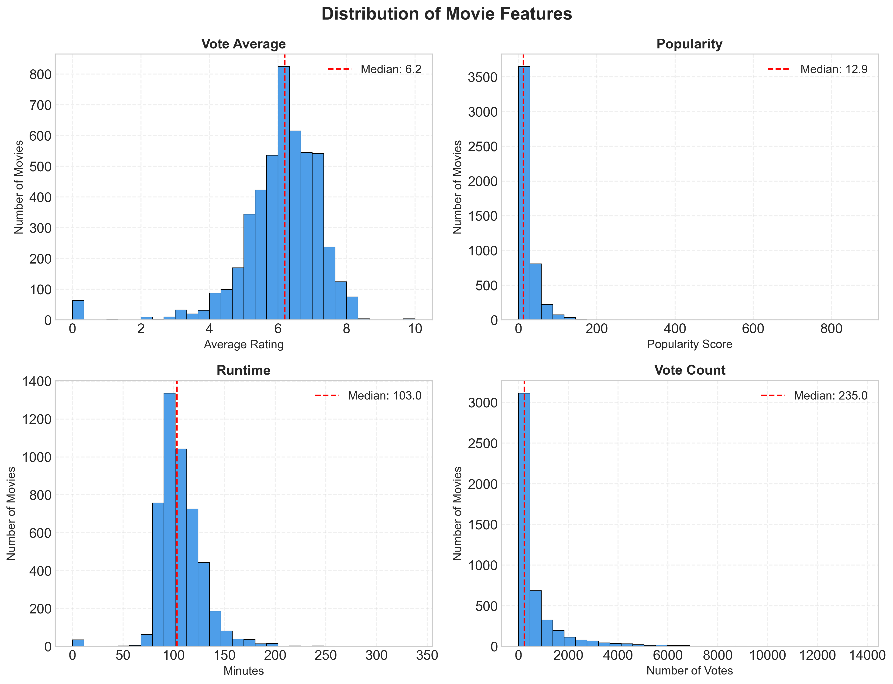

**Key insights:**

- **Vote Average**: Concentrated between 5.5 and 7.5. Extreme values (0 or 10) often reflected sparse voting, motivating the use of Bayesian-weighted ratings.
- **Popularity**: Exhibits a strong long-tail distribution. Logarithmic scaling was applied to prevent blockbuster bias while preserving discoverability of lesser-known films.
- **Runtime**: Median runtimes fall between 90–120 minutes. Extreme outliers (<15 minutes) were treated as data errors and replaced with the median.
- **Vote Count**: Highly right-skewed. Normalization was required to balance confidence and rating reliability.

#### Genre Popularity vs. Quality

One key finding: **genre popularity does not correlate with higher ratings**.

- Less frequent genres (*War*, *History*) consistently achieved higher average ratings
- Popular genres like *Comedy* were not always well-rated despite dominance in the dataset

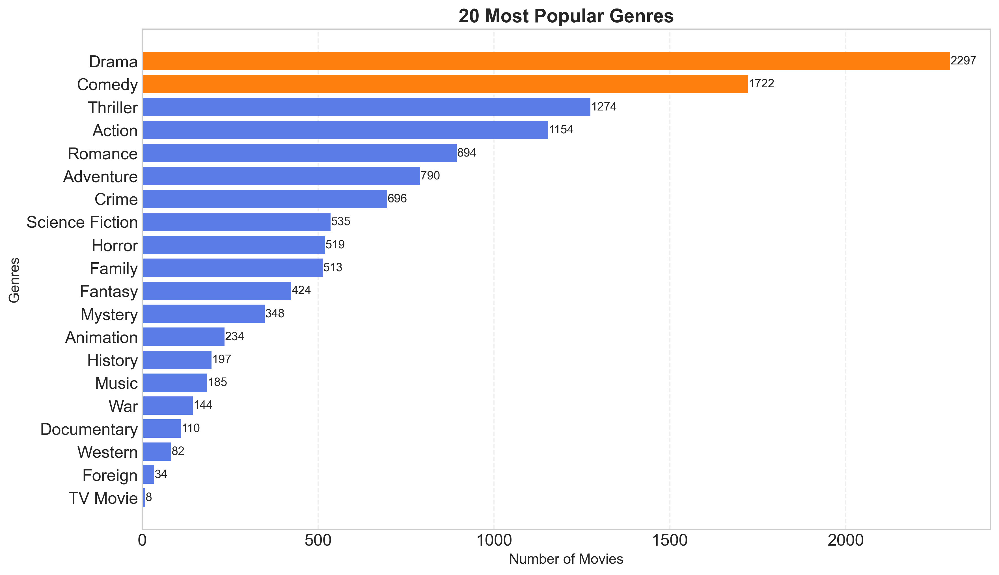
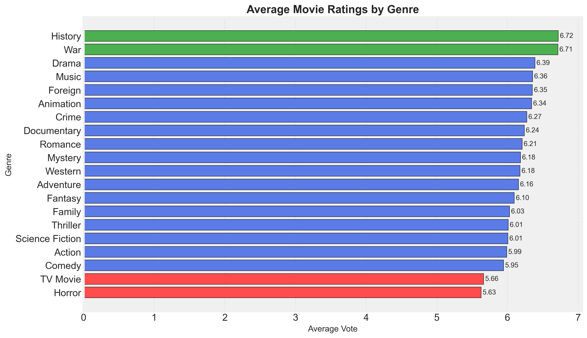

The **Genre Co-occurrence Matrix** visualizes how frequently pairs of genres appear together. Diagonal values represent the total number of films per genre (Drama: 2,297; Comedy: 1,722). High co-occurrence pairs like Drama–Comedy and Action–Thriller indicate genres frequently blended in film production, while rare combinations (Animation–Thriller, War–Romance) reveal stylistic incompatibilities.

#### Correlation Matrix Analysis

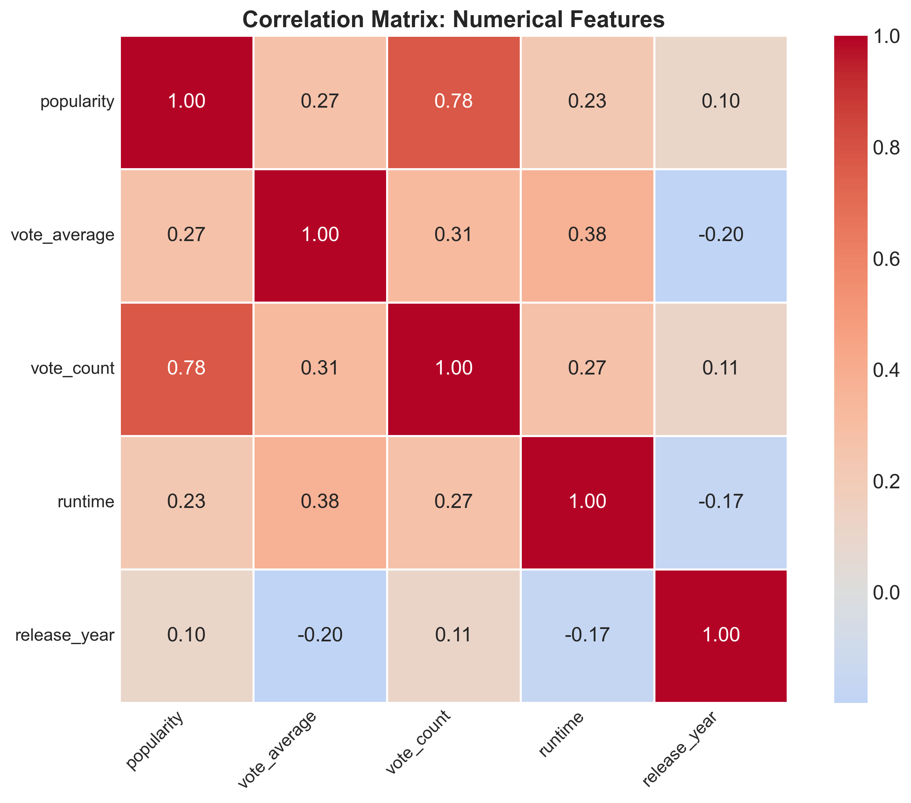

**Key relationships:**

- **Popularity ↔ Vote Count (0.78)**: Strongest correlation. User engagement drives popularity scores, motivating logarithmic scaling to prevent redundancy.
- **Runtime ↔ Vote Average (0.38)**: Moderate positive correlation. Longer films tend to attract slightly higher ratings, possibly due to audience self-selection.
- **Release Year**: Weak negative correlations with vote_average (−0.20) and runtime (−0.17). Newer films are marginally shorter and rated slightly lower — likely influenced by recency bias in voting patterns.

#### Popularity vs. Rating

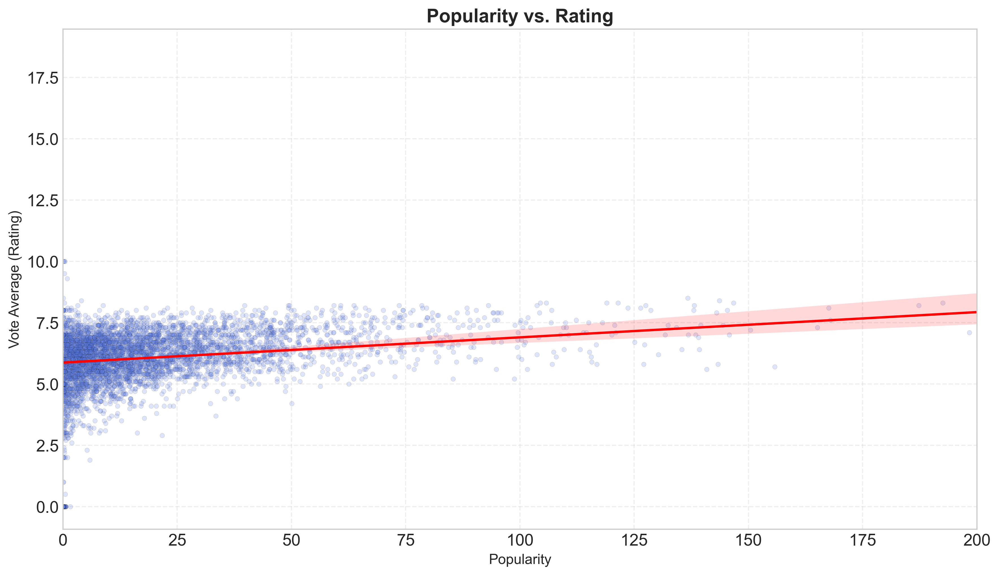

The scatter plot reveals a weak positive correlation (r ≈ 0.3), confirming a fundamental insight: **popularity is not a reliable proxy for quality**.

Two distinct patterns emerge:
1. **Overhyped Titles**: High popularity but ratings below 6.0
2. **Hidden Gems**: Low popularity but ratings above 7.5

To address this, the recommendation engine uses a **hybrid quality score** combining rating and popularity signals with logarithmic scaling and Bayesian-weighted ratings.

---

### 3. Feature Engineering

#### Core Engineered Features

1. **`weighted_rating` (Bayesian Average)**  
   Adjusts a movie's rating toward the global mean when vote count is low. As votes increase, the movie's own rating exerts greater influence. Prevents niche films with few votes from dominating rankings.

2. **`movie_age` (Years Since Release)**  
   Release year transformed into *movie_age* with logarithmic scaling to reduce temporal skew and mitigate recency bias in the recommendation engine.

3. **`tagline_integration` (Text Enrichment)**  
   Taglines concatenated with overviews shorter than 100 characters, enriching the textual representation for NLP processing and ensuring consistent TF-IDF signal quality.

4. **`logarithmic_transformation`**  
   Applied to both popularity and vote count to compress the long-tail distribution. Without transformation, outliers would dominate distance calculations and introduce systematic bias toward blockbusters.

5. **`runtime_cleaning`**  
   Films with runtime below 15 minutes treated as erroneous entries (trailers, shorts, or data errors) and replaced with the dataset median.

#### Quality Score

A composite weighted metric was defined:

**Quality Score = 0.6 × Rating_scaled + 0.4 × Popularity_scaled**

Both features are normalized to [0, 1] using Min-Max scaling before combination. The 60/40 weighting deliberately prioritizes critical reception over commercial reach, ensuring the system surfaces content that is both recognizable and genuinely well-regarded.

---

## 🧠 Model Architecture

### 🛡️ Baseline Model: Cold-Start Recommendation Strategy

**Challenge**: How can we recommend relevant content to users with no prior interaction history?

The baseline model is a **fully independent component** of the recommendation pipeline, activated when a new user has not yet provided any input. Rather than returning an empty state or random selection, new users are immediately presented with a curated list of statistically reliable, high-quality films.

#### Implementation Details

- Filtered movies with vote counts above the **90th percentile** to ensure rating reliability
- Ranked candidates using **Bayesian weighted ratings**
- Applied **temporal preference** (films released after 1990) aligned with dataset distribution
- Enforced **genre diversity** to avoid recommending exclusively from a single category

#### Performance Validation

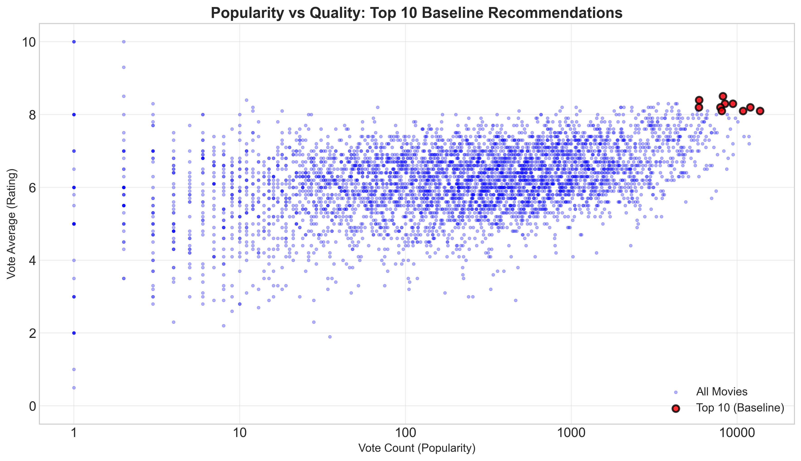

Recommended films (red points) cluster in the **upper-right quadrant**, representing optimal balance between high popularity and high quality.

#### Baseline Model Results

| Metric | Value |
|--------|-------|
| **Average Rating** | 8.24 / 10 (dataset avg: ~6.0) |
| **Genre Coverage** | 10 primary genres |
| **Most Common Genre** | Drama |
| **Temporal Range** | 80% released 1990–2014 |
| **Average Release Year** | 1996 |

---

### 🚀 Main Model: Hybrid Recommendation Engine

The main model leverages **Natural Language Processing** to capture semantic relationships and generate personalized recommendations.

#### Step 1: NLP Processing — Metadata "Soup" Creation

A composite textual representation was constructed by concatenating:
- **Keywords** (themes and plot elements) — boosted 2×
- **Cast** (top 5 billed actors)
- **Director** — boosted 3× to reflect stylistic influence
- **Genres** — weighted by IDF score (rare genres repeated 2–5×)

#### Step 2: Vectorization

**TF-IDF Vectorization** (applied to movie overviews):
- Downweights overly common terms (*Action*, *Drama*)
- Emphasizes distinctive descriptors (*cyberpunk*, *neo-noir*)
- Enables semantic differentiation (e.g., *Space Horror* vs. *Space Comedy*)

**CountVectorizer** (applied to metadata soup):
- Captures explicit term frequency signals for cast, crew, keywords, and genres
- Removes English stop words

This dual approach combines **semantic weighting (TF-IDF)** with **explicit frequency signals (CountVectorizer)**.

#### Step 3: Similarity Computation

Movie similarity is computed using **Cosine Similarity**:

```
similarity(A, B) = (A · B) / (||A|| × ||B||)
```

Scores range from **0** (no similarity) to **1** (identical metadata).

#### Step 4: Recommendation Logic

The recommendation function integrates several refinements:

1. Identify candidate movies based on cosine similarity
2. Apply **logarithmic scaling and popularity penalties** to prevent blockbuster dominance
3. Apply **age-based penalty** to promote temporal diversity
4. Compute **combined hybrid score** incorporating similarity and quality
5. Apply **MMR (Maximal Marginal Relevance)** to balance relevance and diversity

**Without MMR**: Potentially 10 recommendations sharing the same actor, director, or sub-genre  
**With MMR**: Semantically relevant but diverse — different sub-genres, directors, and storylines

#### Step 5: Hybrid Ranking Strategy

**Final Score = α × Quality_norm + (1 − α) × Similarity_norm**

| α Value | Behavior |
|---------|----------|
| **0.3** | 70% similarity, 30% quality (semantic-first) |
| **0.5** | Balanced relevance and quality |
| **0.7** | Quality-driven recommendations |

The optimal α is selected automatically via grid search across the full range, evaluated on a composite score combining quality, diversity, genre overlap, and popularity bias.

---

## 📊 Performance & Evaluation

### Internal Simulation

The model was validated through 20 simulation iterations across 50 randomly sampled movies per iteration (1,000 recommendation sets total).

| Metric | Target Range | Achieved | Status |
|--------|-------------|----------|--------|
| **Quality (Avg Rating)** | ≥ 6.5 | **6.81 / 10** | ✅ Excellent |
| **Diversity Index** | ≥ 0.70 | **0.70** | ✅ High Exploration |
| **Genre Overlap** | 0.60–0.75 | **0.65** | ✅ Balanced |
| **Popularity Bias** | 1.0–2.5 | **1.40** | ✅ Goldilocks Zone |

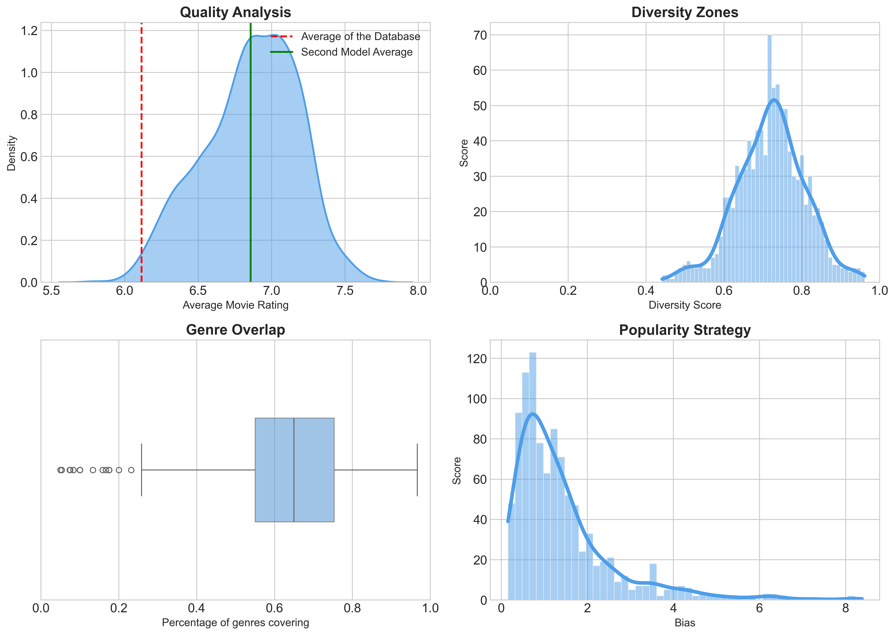

### External Evaluation — Leave-One-Out (MovieLens)

To validate against real user preferences, a Leave-One-Out evaluation was conducted using the **MovieLens dataset** — an external source of verified user ratings entirely independent of the TMDB data used to build the model.

**Methodology**: For each of 500 sampled users, one liked film (rating ≥ 3.5) was selected as the seed. The remaining liked films formed the ground truth. The recommendation function was called with the seed and evaluated against this ground truth.

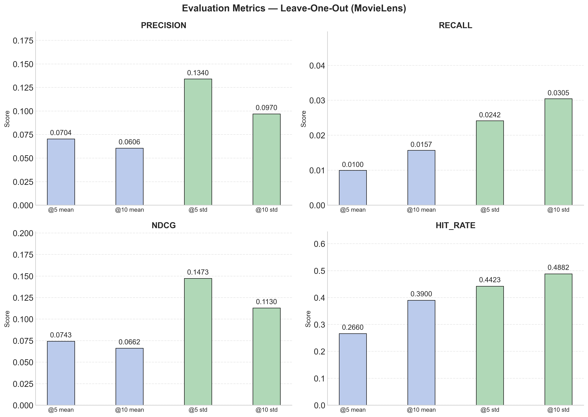

| Metric | @5 | @10 |
|--------|-----|------|
| **Hit Rate** | 26.60% | **39.00%** |
| **Precision** | 7.04% | 6.06% |
| **Recall** | 1.00% | 1.57% |
| **NDCG** | 7.43% | 6.62% |

**Key Insights**:
- **Hit Rate@10 = 39%**: In 2 of 5 cases, the system surfaces at least one film the user genuinely liked — without any viewing history or personalization data
- **Precision@5 = 7.04%**: Relevant films appear early in the ranking, confirming the hybrid scoring function is well-calibrated
- **Recall@10 = 1.57%**: Low by design given the 4,800-film catalog and 10-recommendation constraint — a known trade-off of content-based filtering without collaborative signals
- All results are **65× above random baseline** (random Precision ≈ 0.1%)

---

## 📱 Application Interface

The project is deployed as an interactive **Streamlit** web application.

### Tech Stack

| Layer | Technology |
|-------|------------|
| **Frontend** | Streamlit |
| **Backend** | Scikit-Learn (TF-IDF, CountVectorizer, cosine similarity) |
| **Data Processing** | Pandas, NumPy, SciPy |
| **Visualization** | Matplotlib, Seaborn |
| **Poster Fetching** | TMDB API |
| **Deployment** | Streamlit Cloud |
| **Model Storage** | Hugging Face Hub |

### User Interface

#### Home Page
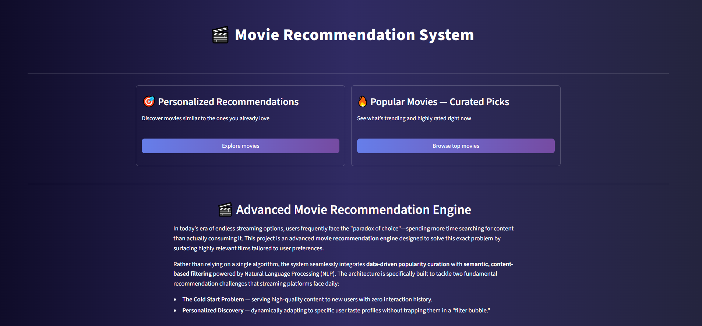

Two main entry points: the **Baseline Model** for new users with no preferences, and the **Intelligent Model** for users who provide a seed movie.

#### Baseline Recommendations
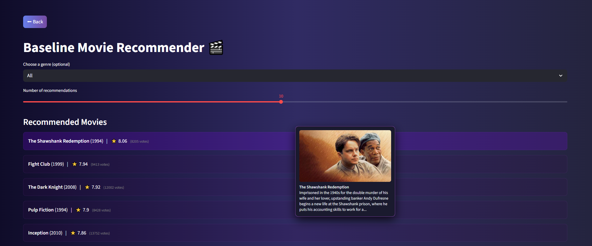

Includes a slider (1–20 movies), genre filter, and hover interactions displaying poster and synopsis.

#### Intelligent Model Recommendations
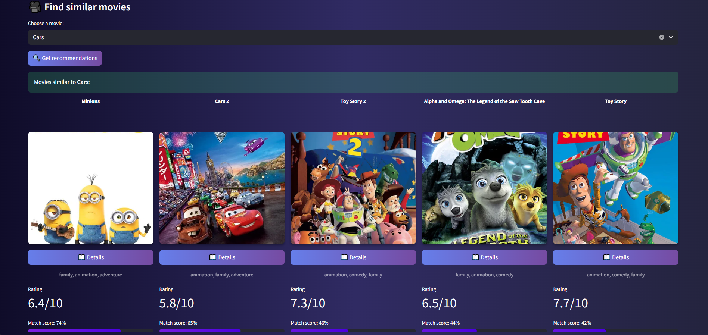
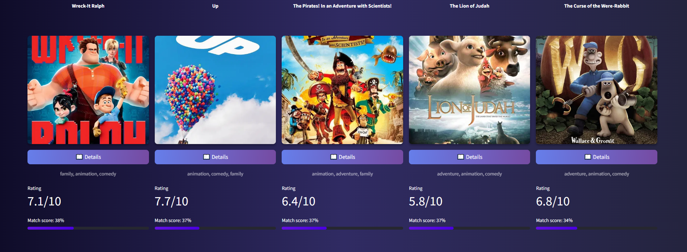

Each recommendation displays:
- **Match %**: Hybrid score (0–100%)
- **Poster**: Dynamically fetched from TMDB API
- **Title & Rating**: Bayesian-weighted score
- **Genres**: Top 2–3 relevant tags
- **Details**: Expandable synopsis and metadata

---

## 🛠️ Installation

### Prerequisites

- Python 3.13+
- MovieLens dataset (for evaluation only) — downloaded automatically by the notebook

### Local Setup

```bash
# 1. Clone the repository
git clone https://github.com/Przemsonn05/Content-Based-Recommendation-System-for-Movies.git

# 2. Navigate to directory
cd Content-Based-Recommendation-System-for-Movies

# 3. Install dependencies
pip install -r requirements.txt

# 4. Add data files to /data
# - tmdb_5000_movies.csv
# - tmdb_5000_credits.csv
# Available at: https://www.kaggle.com/datasets/tmdb/tmdb-movie-metadata

# 5. Launch Streamlit app
streamlit run app.py

# 6. (Optional) Run the full analysis notebook
jupyter notebook notebooks/Recommendation_System.ipynb
```

> **Note**: Pre-trained models are automatically loaded from Hugging Face on first run. No manual download required.

### Project Structure

```
Content-Based-Recommendation-System-for-Movies/
├── data/
│   ├── tmdb_5000_credits.csv        # Raw cast/crew data
│   ├── tmdb_5000_movies.csv         # Raw movie metadata
│   ├── movies.csv                   # MovieLens movies (evaluation)
│   └── ratings.csv                  # MovieLens ratings (evaluation)
├── images/                          # EDA visualizations & UI screenshots
├── notebooks/
│   └── Recommendation_System.ipynb  # Full analysis & model development
├── results/
│   └── evaluation_summary.csv       # Leave-One-Out results
├── src/                             # Source code modules
├── app.py                           # Streamlit application entry point
├── main.py                          # Main recommendation pipeline
├── requirements.txt                 # Python dependencies
├── .gitignore
├── LICENSE
└── README.md
```

---

## 💡 Key Learnings & Future Work

### What Worked

1. **"Metadata Soup" Approach** — Combining cast, crew, keywords, and genres created a richer semantic space than individual features. Context matters more than isolated attributes.
2. **TF-IDF Superiority** — Significantly outperformed simple keyword matching. Generic terms are automatically downweighted. Smart feature engineering beats complex algorithms.
3. **Bayesian Weighting** — Essential for handling confidence variance. Prevents statistical outliers from skewing rankings.
4. **MMR Algorithm** — Balances relevance with diversity. Without it: redundant recommendations. With it: varied suggestions maintaining semantic coherence.
5. **Alpha Parameter Tuning** — Automated optimization improved accuracy and robustness across diverse movie inputs.

### Future Improvements

**Short-Term**:
- Explainability dashboard showing "Why this recommendation?" with score component breakdown
- User feedback loop (thumbs up/down) to iteratively retrain feature weights
- A/B testing framework for weight configuration experiments

**Long-Term**:
- Upgrade NLP layer to **BERT** or **Sentence Transformers** for deeper semantic understanding
- Add conversational interface for natural language queries (*"I want a sad movie about robots with a hopeful ending"*)
- Hybrid collaborative filtering combining content signals with user behavior
- Production deployment on **AWS ECS** or **Google Cloud Run**

---

## 📄 License

This project is licensed under the **MIT License**. See `LICENSE` for details.

---

## 🙏 Acknowledgments

- **TMDB** — Comprehensive movie database and API
- **MovieLens / GroupLens** — Ground truth dataset for external evaluation
- **Scikit-Learn** — Machine learning and vectorization tools
- **Streamlit** — Accessible deployment framework

---

<div align="center">

**⭐ Found this helpful? Please star the repository!**

[](https://github.com/Przemsonn05/Content-Based-Recommendation-System-for-Movies)

**Made by [Przemsonn05](https://github.com/Przemsonn05)**

</div>
